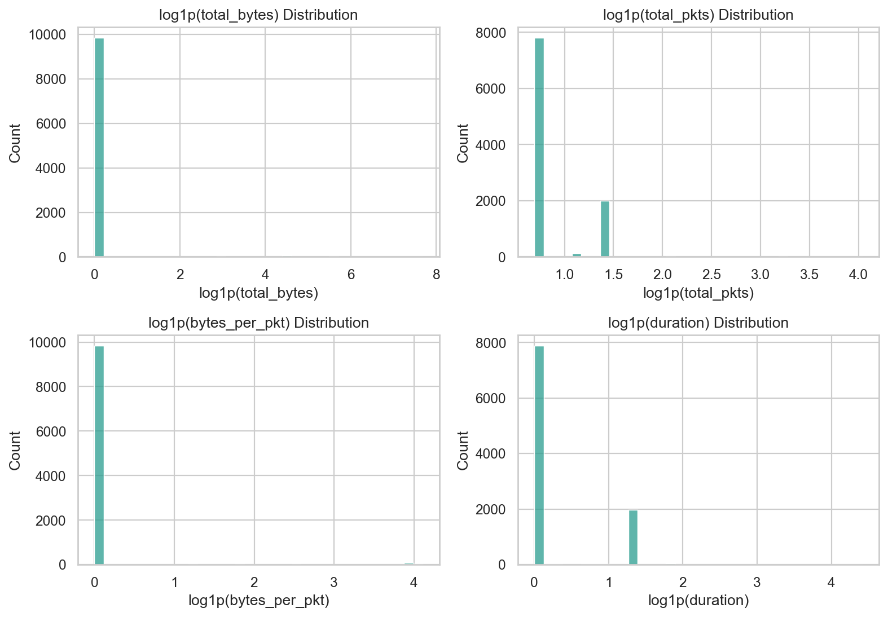
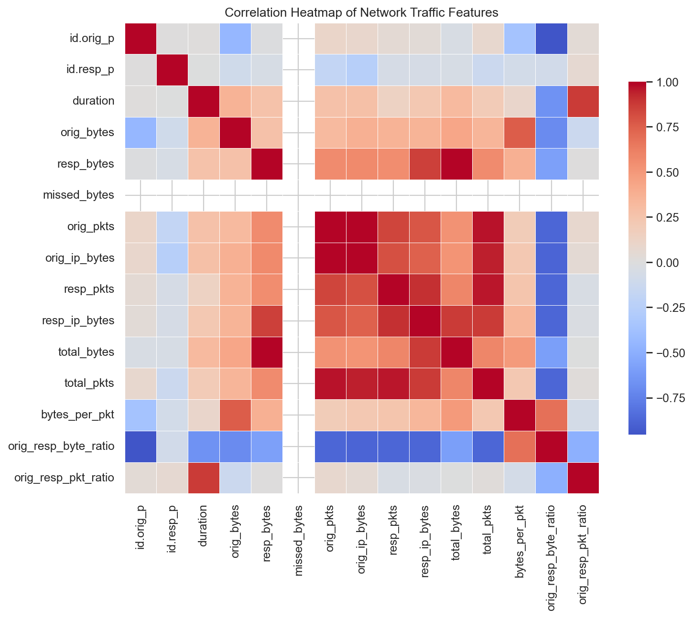
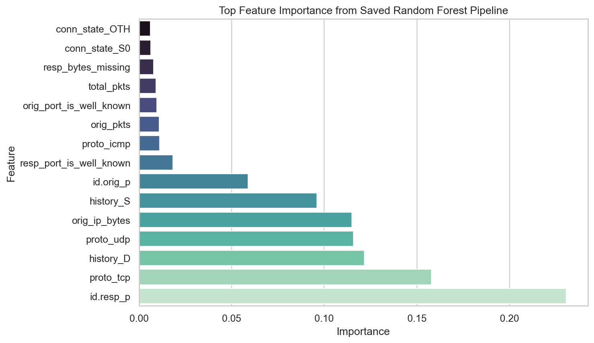
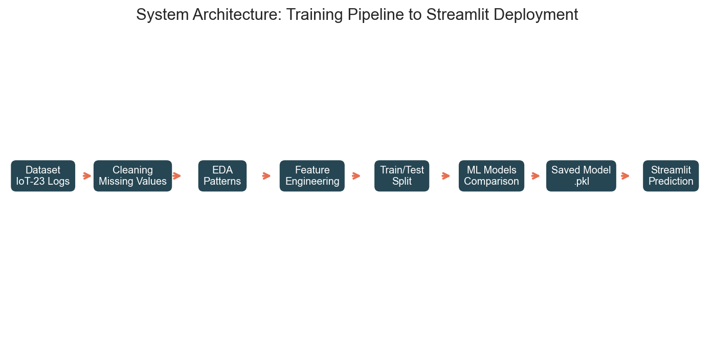
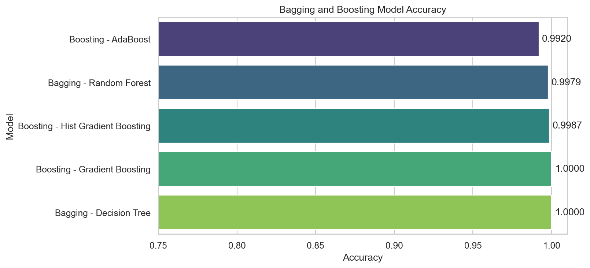
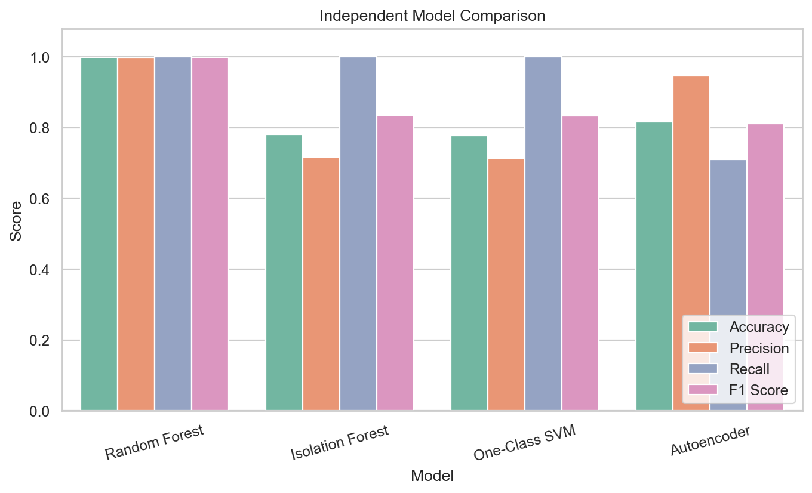
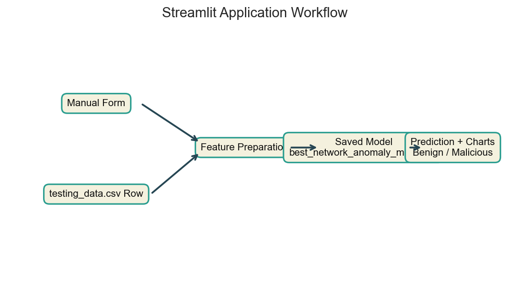
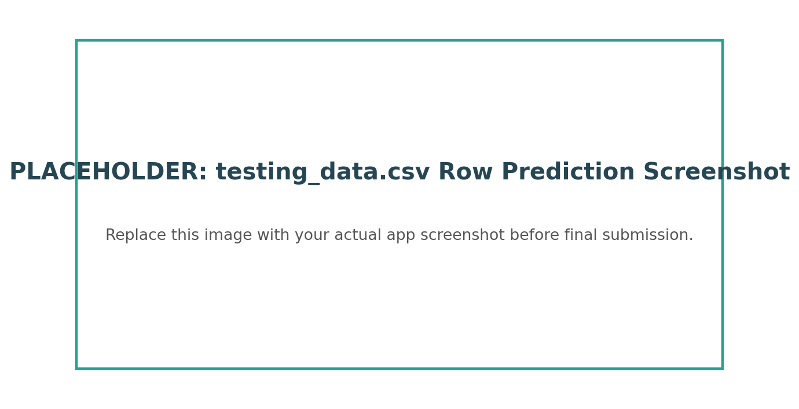

# SIKSHA 'O' ANUSANDHAN

**Deemed To Be University**  
Accredited (3rd Cycle) by NAAC with A++ Grade  
Admission Batch: 2023  
Session: 2025-26

## Major Project Report of
## MACHINE LEARNING CONCEPT - 2 (CSE 3968)

## On
# Network Anomaly Detection Using Machine Learning

Submitted by:

| Name | Registration Number |
|---|---|
| 1. NAME 1 | 2341_____ |
| 2. NAME 2 | 2341_____ |
| 3. NAME 3 | 2341_____ |
| 4. NAME 4 | 2341_____ |

Section: 2341___  
Semester: _____________  
Branch: _______

**Department of Computer Science and Engineering**  
Institute of Technical Education and Research (ITER), S'O'A  
Jagamohan Nagar, Jagamara, Bhubaneswar, Odisha - 751030

**Month, Year:** May, 2026

---

## 1. Abstract

This project presents an **MLC Network Detection System**, a machine learning-based network anomaly detection application. The system detects whether network traffic is **Benign** or **Malicious** by learning patterns from IoT network connection logs. Traditional signature-based intrusion detection systems can identify known attacks, but they are weak against unknown attacks and zero-day threats. Machine learning solves this problem by learning traffic behavior from data and identifying abnormal patterns automatically.

The project uses the **IoT-23 dataset**, which contains labeled benign and malicious IoT traffic. A sample of **50,000 records** was used for training and testing. The workflow includes dataset loading, cleaning, exploratory data analysis, feature engineering, preprocessing, model training, evaluation, model saving, and Streamlit deployment. Several models were trained, including Bagging, Boosting, Random Forest, Isolation Forest, One-Class SVM, and Autoencoder. The best final model was saved as `best_network_anomaly_model.pkl` and integrated into a Streamlit web app.

The final application allows users to enter traffic manually or select one data point from `testing_data.csv`, then predicts whether the traffic is benign or malicious. The app also displays visualizations such as byte volume, packet volume, port summary, and prediction confidence.

---

## 2. Table of Contents

| Section | Title |
|---|---|
| 1 | Abstract |
| 2 | Table of Contents |
| 3 | Introduction |
| 4 | Problem Statement |
| 5 | Objectives |
| 6 | Existing System |
| 7 | Proposed System |
| 8 | Dataset Description and Understanding |
| 9 | Data Preprocessing |
| 10 | Exploratory Data Analysis |
| 11 | Feature Engineering |
| 12 | Model Development and Justification |
| 13 | Training and Testing Pipeline |
| 14 | Evaluation Metrics |
| 15 | Experimental Results |
| 16 | System Architecture |
| 17 | Streamlit Application |
| 18 | Applications |
| 19 | Challenges and Limitations |
| 20 | Future Scope |
| 21 | Conclusion |
| 22 | PPT Outline |
| 23 | References |
| 24 | Appendix |

---

## 3. Introduction

Cybersecurity is a critical requirement in modern computing because internet-connected devices, cloud systems, and IoT networks continuously exchange large volumes of data. Every network connection contains useful information such as protocol, source port, destination port, bytes transferred, packets exchanged, duration, and connection state. These details can indicate whether traffic is normal or suspicious.

Network anomaly detection is the process of identifying unusual network behavior that may indicate a threat. Examples of anomalies include port scanning, malware communication, botnet activity, unauthorized login attempts, denial-of-service traffic, and repeated failed connections. Intrusion Detection Systems (IDS) are used to monitor such traffic.

Traditional IDS tools usually depend on predefined signatures and rules. These tools work well for known attacks but may fail against new attack patterns. Machine learning models can learn from historical traffic and detect suspicious patterns based on behavior, making them useful for modern adaptive cybersecurity systems.

---

## 4. Problem Statement

Modern networks generate a large amount of traffic every second. Manually analyzing this traffic is difficult and time-consuming. Traditional signature-based systems face several challenges:

- They detect only known attacks.
- They require frequent rule updates.
- They may fail against zero-day attacks.
- They can produce high false positives.
- They are difficult to scale for large network logs.
- Attackers constantly modify malware behavior to bypass fixed rules.

The problem is to develop an intelligent machine learning-based system that can analyze network traffic and classify it as **Benign** or **Malicious**. The system should also be usable through a simple web interface so users can test individual traffic records.

---

## 5. Objectives

The objectives of this project are:

- To study network anomaly detection using machine learning.
- To use the IoT-23 dataset for training and testing.
- To clean raw network logs and handle missing values.
- To perform EDA for understanding network traffic patterns.
- To engineer meaningful features from traffic fields.
- To train and compare multiple ML models.
- To evaluate models using accuracy, precision, recall, F1-score, and confusion matrix.
- To save the best model as a `.pkl` file.
- To build a Streamlit app for manual and test-data prediction.
- To visualize model prediction results in an understandable format.

---

## 6. Existing System

Traditional network security systems mainly use:

- Signature-based IDS
- Rule-based firewalls
- Manual log analysis

These systems have limitations. Signature-based IDS can detect known attacks but cannot identify unknown attacks unless a rule already exists. Rule-based firewalls require manual configuration and frequent updates. Manual log analysis becomes impossible when traffic volume is large.

Existing single-model ML approaches may also have limitations. A single model may overfit, perform poorly on unknown patterns, or fail to handle class imbalance. Therefore, this project compares multiple models and uses a saved trained pipeline for deployment.

---

## 7. Proposed System

The proposed system is an intelligent network anomaly detection framework. It uses machine learning models trained on labeled network traffic data. The final model is deployed using Streamlit for user interaction.

Main components:

- Dataset input layer
- Data cleaning layer
- EDA layer
- Feature engineering layer
- ML model training layer
- Model evaluation layer
- Model saving layer
- Streamlit prediction layer

The system supports two prediction modes:

- **Manual Form:** user enters one network traffic record.
- **testing_data.csv Row:** user selects one existing test data point for prediction.

---

## 8. Dataset Description and Understanding

### 8.1 Dataset Used

The project uses the **IoT-23 dataset**, a labeled IoT network traffic dataset from CTU/Stratosphere Laboratory. It contains benign and malicious IoT traffic scenarios. IoT-23 is suitable for this project because IoT devices are common targets for malware, botnets, and scanning attacks.

The notebook used this IoT-23 connection log file:

```text
opt/Malware-Project/BigDataset/IoTScenarios/CTU-IoT-Malware-Capture-1-1/bro/conn.log.labeled
```

Only 50,000 rows were loaded for efficient experimentation:

```python
SAMPLE_SIZE = 50_000
```

### 8.2 Dataset Columns

| Column | Meaning |
|---|---|
| `ts` | Timestamp of the connection |
| `uid` | Unique connection identifier |
| `id.orig_h` | Source/origin IP address |
| `id.orig_p` | Source/origin port |
| `id.resp_h` | Destination/response IP address |
| `id.resp_p` | Destination/response port |
| `proto` | Protocol such as TCP, UDP, ICMP |
| `service` | Application service such as HTTP, DNS, SSH |
| `duration` | Connection duration |
| `orig_bytes` | Bytes sent by origin |
| `resp_bytes` | Bytes sent by response |
| `conn_state` | State of the connection |
| `missed_bytes` | Bytes missed during capture |
| `history` | Packet history behavior |
| `orig_pkts` | Packets sent by origin |
| `resp_pkts` | Packets sent by response |
| `label` | Raw traffic label |

### 8.3 Dataset Understanding

Network traffic data is a combination of numeric and categorical features. Numeric features such as bytes, packets, duration, and port numbers describe traffic volume and behavior. Categorical features such as protocol, service, connection state, and history describe the type and status of the connection.

The target label was cleaned into:

```text
Benign
Malicious
```

This is a binary classification problem.

---

## 9. Data Preprocessing

Data preprocessing was required because the raw dataset contained missing values, mixed data types, and symbols such as `-`.

Steps performed:

- Loaded the data using Pandas.
- Replaced `-`, blank values, and `(empty)` with missing values.
- Converted numeric columns to numeric format.
- Extracted `Benign` and `Malicious` from the raw label.
- Removed unnecessary identifiers such as `uid`.
- Split the data into train and test sets.
- Used Scikit-learn preprocessing pipeline.

The preprocessing pipeline included:

- `SimpleImputer(strategy="median")` for numeric missing values.
- `StandardScaler()` for numeric scaling.
- `SimpleImputer(strategy="most_frequent")` for categorical missing values.
- `OneHotEncoder(handle_unknown="ignore")` for categorical encoding.

This preprocessing is important because ML models require clean numeric input and consistent feature representation during both training and prediction.

---

## 10. Exploratory Data Analysis

EDA was performed to understand the behavior of the dataset before model training.

### 10.1 Class Distribution

The class distribution shows how many records belong to benign and malicious traffic. This helps identify imbalance in the dataset.


**Figure 1:** Distribution of benign and malicious traffic in the testing dataset.

### 10.2 Numeric Feature Distribution

Network traffic features such as bytes, packets, and duration are often skewed. Log transformation helps visualize these values clearly.



**Figure 2:** Distribution of important numeric traffic features after log transformation.

### 10.3 Correlation Heatmap

The correlation heatmap shows relationships between numeric features. For example, packet count and byte count may be related because more packets usually transfer more bytes.



**Figure 3:** Correlation between network traffic features.

### 10.4 EDA Intuition

EDA helps understand why certain features matter:

- Malicious traffic may create many failed or short connections.
- Port scanning often produces many low-byte connections.
- Malware may communicate repeatedly with specific destination ports.
- Abnormal packet-to-byte ratios may indicate suspicious behavior.
- Missing response bytes may indicate blocked, failed, or scanning traffic.

These observations guide feature engineering and model selection.

---

## 11. Feature Engineering

Feature engineering transforms raw traffic fields into more meaningful variables. This improves model learning because attack behavior is often hidden in relationships between features rather than single columns.

### 11.1 Engineered Features

| Engineered Feature | Meaning | Importance |
|---|---|---|
| `service_missing` | Whether service value is missing | Missing services can indicate incomplete or suspicious traffic |
| `history_missing` | Whether packet history is missing | Helps detect incomplete logs |
| `orig_bytes_missing` | Whether origin bytes are missing | Can indicate failed connection |
| `resp_bytes_missing` | Whether response bytes are missing | No response may suggest scanning or blocked traffic |
| `hour` | Hour extracted from timestamp | Captures time-based traffic behavior |
| `dayofweek` | Day of week extracted from timestamp | Captures periodic behavior |
| `total_bytes` | Origin bytes + response bytes | Measures total data volume |
| `total_pkts` | Origin packets + response packets | Measures packet volume |
| `bytes_per_pkt` | Average bytes per packet | Detects abnormal packet size |
| `orig_resp_byte_ratio` | Origin-to-response byte ratio | Captures communication imbalance |
| `orig_resp_pkt_ratio` | Origin-to-response packet ratio | Captures packet imbalance |
| `orig_port_is_well_known` | Source port <= 1024 | Identifies well-known source port behavior |
| `resp_port_is_well_known` | Destination port <= 1024 | Identifies common service ports |
| `orig_ip_prefix` | First two IP octets of source IP | Captures network-level source behavior |
| `resp_ip_prefix` | First two IP octets of destination IP | Captures network-level target behavior |

### 11.2 Feature Importance

The saved Random Forest pipeline provides feature importance values. These values show which features influenced model decisions the most.



**Figure 4:** Top feature importance values from the saved Random Forest model.

Feature importance helps explain why the model performs well. In network anomaly detection, port behavior, connection state, packet count, byte volume, and missing-value flags are often strong indicators of suspicious behavior.

---

## 12. Model Development and Justification

Multiple models were trained to compare both supervised and anomaly detection approaches.

### 12.1 Isolation Forest

Isolation Forest is an unsupervised anomaly detection model. It detects anomalies by isolating unusual points using random trees. It is useful for high-dimensional outlier detection and unknown attack discovery.

### 12.2 One-Class SVM

One-Class SVM learns the boundary of normal traffic and marks records outside the boundary as anomalies. It is useful when the goal is to detect deviations from normal behavior.

### 12.3 Autoencoder

An Autoencoder is a deep learning model that learns to reconstruct normal traffic. If reconstruction error is high, the input may be anomalous. It is useful for learning complex non-linear patterns.

### 12.4 Random Forest

Random Forest is a supervised ensemble model made of many decision trees. It is robust, accurate, and handles mixed feature types well after preprocessing. It performed best among the independent models and was saved as the final `.pkl` model.

### 12.5 Bagging and Boosting

Bagging reduces variance by training models on different samples of data. Boosting improves weak learners by focusing on mistakes made by previous learners. Both techniques improve robustness and accuracy.

---

## 13. Training and Testing Pipeline

The training pipeline is:

```text
IoT-23 Dataset
    -> Data Cleaning
    -> EDA
    -> Feature Engineering
    -> Train-Test Split
    -> Preprocessing Pipeline
    -> Model Training
    -> Model Evaluation
    -> Best Model Selection
    -> Save as .pkl
    -> Streamlit Deployment
```



**Figure 5:** Complete system architecture from dataset to Streamlit deployment.

The model was saved using:

```python
joblib.dump(best_model, "best_network_anomaly_model.pkl")
```

Saving the trained model allows the Streamlit app to make predictions without retraining.

---

## 14. Evaluation Metrics

| Metric | Meaning | Importance in This Project |
|---|---|---|
| Accuracy | Correct predictions / total predictions | Shows overall performance |
| Precision | Correct malicious predictions / total predicted malicious | Reduces false alarms |
| Recall | Correct malicious predictions / total actual malicious | Important for catching attacks |
| F1-score | Harmonic mean of precision and recall | Balanced performance measure |
| Confusion Matrix | Shows true/false predictions by class | Helps understand model errors |

In cybersecurity, **recall is very important** because missing an actual attack can be harmful. F1-score is also important because it balances precision and recall.

---

## 15. Experimental Results

### 15.1 Bagging and Boosting Models

The following table compares ensemble models trained in the notebook. Accuracy values are exact from notebook output. Precision, recall, and F1-score are taken from the notebook classification reports, rounded to two decimals.

| Model | Accuracy | Precision | Recall | F1 Score |
|---|---:|---:|---:|---:|
| Bagging - Decision Tree | 1.0000 | 1.00 | 1.00 | 1.00 |
| Boosting - Gradient Boosting | 1.0000 | 1.00 | 1.00 | 1.00 |
| Boosting - Hist Gradient Boosting | 0.9987 | 1.00 | 1.00 | 1.00 |
| Bagging - Random Forest | 0.9979 | 1.00 | 1.00 | 1.00 |
| Boosting - AdaBoost | 0.9920 | 0.99 | 0.99 | 0.99 |



**Figure 6:** Accuracy comparison for bagging and boosting models.

### 15.2 Independent Model Comparison

| Model | Accuracy | Precision | Recall | F1 Score |
|---|---:|---:|---:|---:|
| Random Forest | 0.9979 | 0.9962 | 1.0000 | 0.9981 |
| Isolation Forest | 0.7797 | 0.7168 | 1.0000 | 0.8350 |
| One-Class SVM | 0.7771 | 0.7144 | 1.0000 | 0.8334 |
| Autoencoder | 0.8158 | 0.9462 | 0.7100 | 0.8113 |



**Figure 7:** Accuracy, precision, recall, and F1-score comparison for independent models.

### 15.3 Result Analysis

Random Forest performed best among the independent models because it uses multiple decision trees and combines their outputs. It handles non-linear relationships and mixed feature patterns effectively. Isolation Forest and One-Class SVM achieved perfect recall, meaning they detected all malicious samples, but their precision was lower because they also marked many benign records as malicious. Autoencoder had high precision but lower recall, meaning it was careful in predicting malicious traffic but missed some attacks.

The best final model was:

```text
Random Forest
```

Saved model file:

```text
best_network_anomaly_model.pkl
```

---

## 16. System Architecture

The project has two major phases:

1. **Training Phase:** dataset is cleaned, transformed, used for model training, and the best model is saved.
2. **Deployment Phase:** Streamlit loads the saved model and predicts new traffic records.

This architecture separates training from prediction. Therefore, the app does not retrain the model every time; it only loads the saved pipeline and predicts.

---

## 17. Streamlit Application

Streamlit is an open-source Python framework for building interactive data and machine learning applications. In this project, Streamlit converts the ML model into a usable web application.

### 17.1 App File

Main app file:

```text
app.py
```

Saved model:

```text
best_network_anomaly_model.pkl
```

### 17.2 App Features

The app includes:

- Title: **MLC Network Detection System**
- Sidebar model status
- Label guide for Benign and Malicious
- Manual traffic input form
- `testing_data.csv` row selector
- Actual label display for testing data
- Prediction output
- Prediction confidence chart
- Byte volume chart
- Packet volume chart
- Port summary chart
- Engineered feature table



**Figure 8:** Streamlit app prediction workflow.

### 17.3 How Prediction Works in the App

```text
User Input / testing_data.csv Row
        -> Feature Preparation
        -> Saved .pkl Model
        -> Prediction
        -> Visualization
```

### 17.4 How to Run the App

```bash
cd D:\MLC_Projects
python -m streamlit run app.py
```

Then open:

```text
http://localhost:8501
```

### 17.5 Screenshot Placeholders

Add these screenshots before final submission:


**Figure 9:** Streamlit home page and model status.


**Figure 10:** Manual form prediction output.



**Figure 11:** Prediction using one data point from `testing_data.csv`.

If the placeholder image files are not available, replace these lines with your actual screenshots.

---

## 18. Applications

This project can be used in:

- Enterprise network monitoring.
- IoT device security.
- Cloud infrastructure protection.
- Smart city network monitoring.
- Educational cybersecurity demonstrations.
- Preliminary intrusion detection systems.
- Security dashboards for small organizations.

---

## 19. Challenges and Limitations

### 19.1 Challenges Faced

- Dataset contained missing values and mixed data types.
- Network traffic features were skewed.
- Some anomaly models required special binary-label handling.
- One-Class SVM can be slow on large datasets.
- Autoencoder required threshold selection.
- Saved `.pkl` model required compatible Scikit-learn version.
- Manual app input had to match the same feature format used during training.

### 19.2 Limitations

- Only 50,000 rows were used for this version.
- Real-time packet capture is not implemented.
- The app predicts one record at a time.
- Model performance depends on dataset quality.
- Unknown future attacks may require retraining.
- Current app is a demonstration system, not a full production IDS.

---

## 20. Future Scope

Future improvements may include:

- Real-time packet monitoring.
- Batch CSV prediction in Streamlit.
- Cloud deployment.
- Integration with firewall/IDS tools.
- Explainable AI using SHAP or LIME.
- More IoT-23 scenarios.
- Deep learning optimization.
- SIEM integration.
- Alert system through email or dashboard notifications.

---

## 21. Conclusion

The MLC Network Detection System successfully demonstrates how machine learning can be used for network anomaly detection. The project covers a complete ML workflow from dataset loading to model deployment. The IoT-23 dataset was cleaned, analyzed, transformed, and used to train multiple ML models.

Random Forest achieved the best independent performance with:

```text
Accuracy: 0.9979
Precision: 0.9962
Recall: 1.0000
F1-score: 0.9981
```

The best model was saved as `best_network_anomaly_model.pkl` and imported into a Streamlit app. The app provides manual prediction and `testing_data.csv` row prediction with helpful visualizations. This makes the project practical, understandable, and suitable for demonstration.

---

## 22. Professional PPT Outline

Use this outline for the final presentation. It keeps the full report content short enough for a clear 25-slide professional PPT.

| Slide | Title | Main Content |
|---:|---|---|
| 1 | Title Slide | Project title, team members, department, academic year |
| 2 | Cybersecurity Overview | Growth of connected devices and cyber threats |
| 3 | Network Anomaly Detection | Traffic, anomalies, IDS meaning |
| 4 | Problem Statement | Signature systems fail on unknown attacks |
| 5 | Motivation | IoT attacks, zero-day threats, large log volume |
| 6 | Proposed Solution | ML-based adaptive detection system |
| 7 | Objectives | Detection, comparison, deployment, visualization |
| 8 | Existing System | Signature IDS, rule-based firewalls, limitations |
| 9 | Proposed Architecture | Dataset to Streamlit prediction workflow |
| 10 | Dataset Used | IoT-23 dataset and traffic fields |
| 11 | Data Understanding | Numeric/categorical fields and target label |
| 12 | Data Preprocessing | Missing values, encoding, scaling, train-test split |
| 13 | EDA - Class Distribution | Benign vs malicious traffic graph |
| 14 | EDA - Feature Behavior | Bytes, packets, duration, correlation heatmap |
| 15 | Feature Engineering | Derived traffic behavior features |
| 16 | Feature Importance | Top Random Forest features |
| 17 | Models Used | Isolation Forest, One-Class SVM, Autoencoder, Random Forest |
| 18 | Bagging and Boosting | Ensemble models and why they were used |
| 19 | Training Pipeline | Preprocessing, model training, evaluation |
| 20 | Evaluation Metrics | Accuracy, precision, recall, F1-score, confusion matrix |
| 21 | Ensemble Results | Bagging/boosting comparison table |
| 22 | Independent Results | Random Forest and anomaly model comparison |
| 23 | Streamlit App | Manual input and testing CSV prediction |
| 24 | Applications and Future Scope | Real-world uses and future enhancements |
| 25 | Conclusion | Final outcome and key learning |

---

## 23. References

1. Streamlit Documentation, "Streamlit is an open-source Python framework for data scientists and AI/ML engineers to deliver dynamic data apps." https://docs.streamlit.io/
2. Scikit-learn Documentation, `RandomForestClassifier`. https://scikit-learn.org/1.5/modules/generated/sklearn.ensemble.RandomForestClassifier.html
3. KDD Cup 1999 Dataset, ACM SIGKDD. https://www.kdd.org/kdd-cup/view/kdd-cup-1999/Data
4. IoT-23 Dataset, Stratosphere Laboratory. https://www.stratosphereips.org/datasets-iot23
5. Pandas Documentation. https://pandas.pydata.org/
6. TensorFlow Documentation. https://www.tensorflow.org/

---

## 24. Appendix

### 24.1 Project Files

| File | Purpose |
|---|---|
| `MLC_NetWordDetection_System.ipynb` | Model training notebook |
| `best_network_anomaly_model.pkl` | Saved trained model |
| `app.py` | Streamlit application |
| `testing_data.csv` | Testing records for app prediction |
| `requirements.txt` | Python dependencies |
| `report_assets/` | Report figures and charts |

### 24.2 Important Command

```bash
python -m streamlit run app.py
```

### 24.3 Screenshot Checklist

- Notebook dataset loading
- EDA class distribution
- Correlation heatmap
- Feature importance chart
- Model comparison table
- Streamlit manual prediction
- Streamlit `testing_data.csv` row prediction
- Final prediction output
